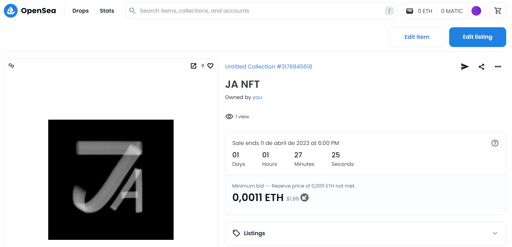

# Desafio de Criação de Token Não Fungível (NFT) na OpenSea Polygon

Neste desafio, foi criado um Token Não Fungível (NFT) na Blockchain gratuita OpenSea Polygon. O NFT é um tipo especial de criptomoeda que representa um ativo digital exclusivo, como uma obra de arte, um vídeo, um jogo, entre outros.

## Como foi criado o NFT

Para criar o NFT, foi necessário seguir as instruções e o passo a passo fornecidos pelo instrutor. Algumas das etapas realizadas incluíram:

- Criar uma conta na OpenSea Polygon;
- Configurar um projeto na OpenSea Polygon;
- Criar um arquivo com as informações do NFT, como nome, descrição e imagem;
- Fazer o upload do arquivo na plataforma OpenSea Polygon;
- Configurar as opções de venda do NFT, como preço e quantidade disponível.

## Vantagens da OpenSea Polygon

A OpenSea Polygon é uma plataforma de blockchain gratuita que permite a criação e venda de NFTs. Algumas das vantagens da plataforma incluem:

- Baixo custo de transação;
- Alta velocidade de processamento;
- Integração com outras plataformas de blockchain;
- Suporte a diferentes tipos de criptomoedas;
- Facilidade de uso.

## Conclusão

Este desafio foi uma ótima oportunidade para aprender sobre a criação de NFTs na OpenSea Polygon e as vantagens que a plataforma oferece. Além disso, foi possível entender melhor como a tecnologia blockchain está revolucionando a maneira como os ativos digitais são criados e comercializados.

    

